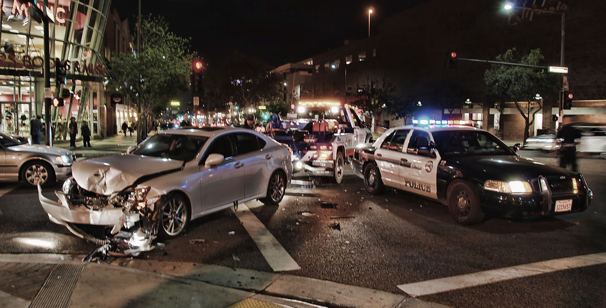

.. DeepStack documentation master file, created by
   sphinx-quickstart on Wed Dec 12 17:30:35 2018.
   You can adapt this file completely to your liking, but it should at least
   contain the root `toctree` directive.

Traffic Recognition
====================

The traffic recognition api classifies an image into one of the following ::
    Sparse traffic
    Dense traffic
    Accident
    Fire

With this, from images of live traffic, you can tell if an accident has occured,
if there is traffic gridlock or if a vehicle is on fire.

**Example**

::

    const request = require("request")
    const fs = require("fs")

    image_stream = fs.createReadStream("test-image4.jpg")

    var form = {"image":image_stream}

    request.post({url:"http://localhost:80/v1/vision/traffic", formData:form},function(err,res,body){

        response = JSON.parse(body)
        console.log(response)

    })

Result ::

    { predictions: [ { confidence: 94.88775730133057, label: 'accident' } ],
  success: true }
